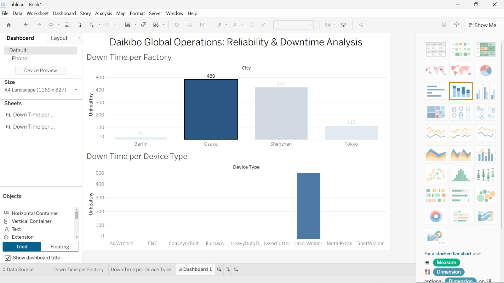

# Deloitte Australia Data Analytics Simulation — Forage

## Overview
Completed Deloitte Australia's Data Analytics job simulation on Forage, 
involving real-world forensic technology data analysis.

## Business Problem
Analyzed organizational data to identify patterns and present 
business conclusions in a consulting context.

## Tools Used
- Tableau — built interactive dashboard
- Excel — data classification and business analysis

## What I Did
- Completed data analysis on a forensic technology dataset
- Built a Tableau dashboard to visualize key findings
- Used Excel to classify data and draw actionable conclusions
- Presented insights in a structured business format
- ## Dashboard Preview

## Key Skills Demonstrated
- Data visualization and storytelling
- Business problem structuring
- Excel-based data classification
- Dashboard design for non-technical stakeholders

## Certificate
Deloitte Australia — Data Analytics Virtual Experience
Completed via Forage | April 2025
